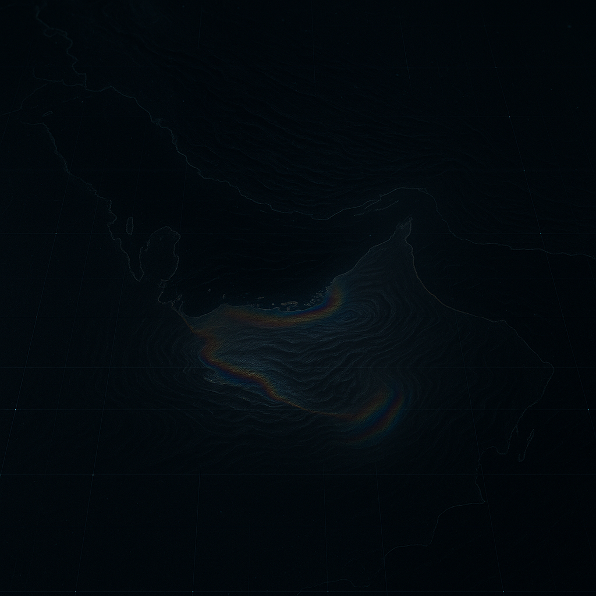

# 🛰️ Oil Spill Detection from Satellite Imagery

Welcome to the **Computer Vision Project - Satellite Team** repository!  
This project leverages deep learning and satellite imagery to detect oil and gas spills in the world’s oceans, supporting environmental protection and marine safety.
<p align="center">
  
</p>


## 🌍 Overview

**Petra** (Petroleum + Terra) is an AI-powered system designed to automatically identify oil slicks and gas spills from Sentinel-1 SAR satellite images.  
Our mission is to provide scalable, real-time monitoring for authorities and researchers.

---

## 🚀 Features

- 🧠 **YOLO11 model trained** on real SAR satellite images for oil spill detection
- 📊 **Streamlit Dashboard** for interactive visualization and prediction  
- ⚙️ **FastAPI Backend** for scalable inference  
- 🔄 **Data Augmentation & Preprocessing** for robust detection  
- 🗺️ **3D Satellite Map** with demo detection points 

---

## 📂 Project Structure

```plaintext
api/
├── inference.py
└── main.py

data/
├── train/
│   ├── images/
│   └── labels/
├── val/
│   ├── images/
│   └── labels/
├── test/
│   ├── images/
│   └── labels/

model/
└── oil_spill_best_md_obj.pt

notebooks/                     # Jupyter notebooks for data cleaning and model training
├── DataCleanning.ipynb
└── training.ipynb

src/                           # Source code (Streamlit app, FastAPI integration, assets)
├── main.py
├── background.png
├── earth_zoom.mp4
├── gas_1.jpg
├── oil_1.jpg
├── train_gas.jpg
└── train_oil.jpg

environment.yml                # Conda environment specification
README.md                      # Project documentation
.gitignore                     # Files/folders to ignore in version control
data.yaml                      # Dataset configuration

```


## 🧠 Model Architecture  

### A. Backbone – *Feature Extraction*  
- **Purpose:** Extract hierarchical features from satellite images.  
- **Structure:** Deep CNN with residual connections (**125 layers**).  
- **Flow:** Channels progress **3 → 64 → 128** and beyond.  
- **Key Features:**  
  - **Cross Stage Partial (CSP):** Improves gradient flow and reduces computation.  
  - **Spatial Pyramid Pooling (SPP):** Captures multi-scale features (useful for varying oil spill sizes).  

### B. Neck – *Feature Fusion*  
- **Purpose:** Fuse and refine features from multiple scales.  
- **Structure:** Combination of **Feature Pyramid Network (FPN)** and **Path Aggregation Network (PAN)**.  
- **Why Important:** Oil spills can appear in different shapes and sizes across satellite imagery; multi-scale fusion improves detection robustness.  

### C. Head – *Detection Output*  
- **Purpose:** Generate the final predictions.  
- **Outputs:**  
  - **Bounding Boxes:** `(x, y, width, height)` coordinates.  
  - **Objectness Score:** Probability of an object being present.  
  - **Class Probabilities:** Likelihood across defined classes (e.g., oil spill vs. background).  


### **Base Model**: YOLOv11-Medium (`yolo11m.pt`)  
- **Parameters:** 20,032,345  
- **Computational Cost:** 67.7 GFLOPs  
- **Architecture:** 125 layers with advanced neck and head design


---

## 🏷️ Labels

Class 0: Rainbow

Class 1: Sheen

Class 2: Truecolor

Format: YOLO (normalized class x_center y_center width height)

---
📊 Dataset Status

Removed: Empty labels and dropped the object class

Classes in use: rainbow, sheen, truecolor

Counts (approx.):

train: sheen ≈ 1158, rainbow ≈ 621

val: sheen ≈ 37, rainbow ≈ 2

test: sheen ≈ 165, rainbow ≈ 50

---

## 📈 Performance

- **Accuracy:** >93.7% on unseen test data
- **F1-Score:** 88.7
- **Loss:** 0.847
- **Low False Positives:** Robust detection of subtle spill patterns

---

## 🛠️ Team Tasks & Contributions

- **Data Collection & Cleaning:**  
   collected Sentinel-1 SAR satellite images, cleaned, Label Mapping, and Model Preparation
    <br>
  *Contributor: Luluh*

- **Dataset Organization:**  
  Structured and organized the dataset to ensure high quality
    <br>
  *Contributor: Luluh*


- **AI Engineer:**  
  Built the deep learning model for automatic oil spill detection
    <br>
  *Contributor: Ziyad*

- **Image Preprocessing:**  
  Performed georeferencing and resizing of images
    <br>
  *Contributor: Lames*

- **Data Visualization:**  
  Visualized sample oil spill detections on maps
    <br>
  *Contributor: Lames*


- **Front-End Development:**  
  Developed the user interface using FastAPI
    <br>
  *Contributor: Ziyad,Faisal*

- **Front-End Development:**  
  Developed the user interface using Streamlit
    <br>
  *Contributors: Faisal, Mymoonah*

- **REDME FILE:**  
create REDME file
  <br>
  *Contributor: Luluh*

---

## 💻 Quickstart

**1. Clone the repository**
```bash
git clone https://github.com/<your-org>/computer-vision-project-satellite-team.git
cd computer-vision-project-satellite-team
```

 **2. Setup environment**
 ```bash
conda env create -f environment.yml
conda activate satellite-cv
```

3. Run Streamlit app
 ```bash
cd src
streamlit run main.py
```

4. Start FastAPI backend
 ```bash
cd src
streamlit run main.py
```


## 📡 Demo

Upload satellite images for prediction
View detection results and confidence scores
Explore demo points on interactive 3D map


## 🤝 Contributors  

- **Luluh**  
- **Ziyad**  
- **Faisal**  
- **Lames**  
- **Mymoonah**


## 📜 License
This project is licensed under the MIT License.
See LICENSE for details.
